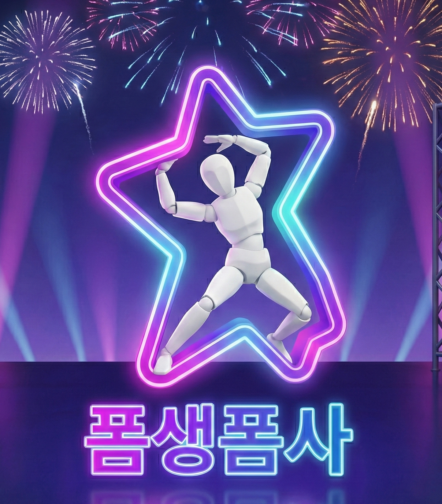

# 🤸 7조 폼생폼사 (Pomsaengpomsa) 🤸

  

  

 

**p5.js로 구현된 인터랙티브 포즈 맞추기 게임! 마우스 또는 웹캠을 사용하여 캐릭터를 조종하고, 제한 시간 안에 다양한 포즈를 완성하여 최고 점수에 도전하세요!**

 

## 🧑‍💻 개발자 (Developers)

*   김동민
*   이가영
*   임소연

## ✨ 주요 기능 (Features)

*   **✌️ 두 가지 게임 모드**:
    *   **포즈 맞추기**: 화면에 제시되는 목표 포즈를 정확하게 따라 하세요.
    *   **벽 통과하기**: 다가오는 벽의 구멍 모양에 맞게 캐릭터의 자세를 만드세요.
*   **🕹️ 두 가지 조작 방식**:
    *   **마우스 모드**: 캐릭터의 관절을 직접 클릭하고 드래그하여 포즈를 만듭니다.
    *   **카메라 모드**: 웹캠으로 플레이어의 신체를 인식하여 캐릭터를 실시간으로 조종합니다. (T-포즈 캘리브레이션 필요)
*   **🏃‍♂️ 래그돌(Ragdoll) 캐릭터**: 물리 기반으로 움직이는 래그돌 캐릭터를 조종하는 재미를 느껴보세요.
*   **🏆 점수 및 랭킹 시스템**:
    *   포즈의 정확도에 따라 실시간으로 점수가 계산됩니다.
    *   게임 종료 후 닉네임과 함께 점수가 기록되며, 로컬 저장소를 통해 상위 10위까지 랭킹을 확인할 수 있습니다.

## 🎮 게임 방법 (How to Play)

1.  **시작 화면**에서 닉네임을 입력하세요.
2.  **조작 방식**을 선택하세요. (`마우스` 또는 `카메라`)
3.  **게임 맵**을 선택하세요. (`포즈` 또는 `벽`)
4.  **게임 시작** 버튼을 눌러 게임을 시작합니다.
    *   `카메라` 모드 선택 시, 화면 안내에 따라 양팔을 벌린 T-포즈로 캘리브레이션을 진행해야 합니다.
5.  **60초**의 제한 시간 동안 최대한 높은 점수를 획득하세요!
6.  게임이 종료되면 최종 점수를 확인하고, `처음으로` 돌아가거나 `크레딧`을 볼 수 있습니다.

## 🛠️ 기술 스택 및 주요 구현 (Tech Stack & Implementation)

*   **엔진/라이브러리**: **p5.js**
*   **언어**: **JavaScript**, **HTML5**, **CSS**

### 🤖 AI 활용 코드 고지

> 이 게임의 소스 코드 중 일부(약 40%)는 **OpenAI ChatGPT**, **Google Gemini**의 도움을 받아 작성·수정되었습니다. AI가 제안한 코드는 개발자가 직접 이해하고 검토한 후 프로젝트에 맞게 수정하여 반영하였습니다.

 

> In class Media&Tech, Department of Media Management, Soongsil University, 2025.

